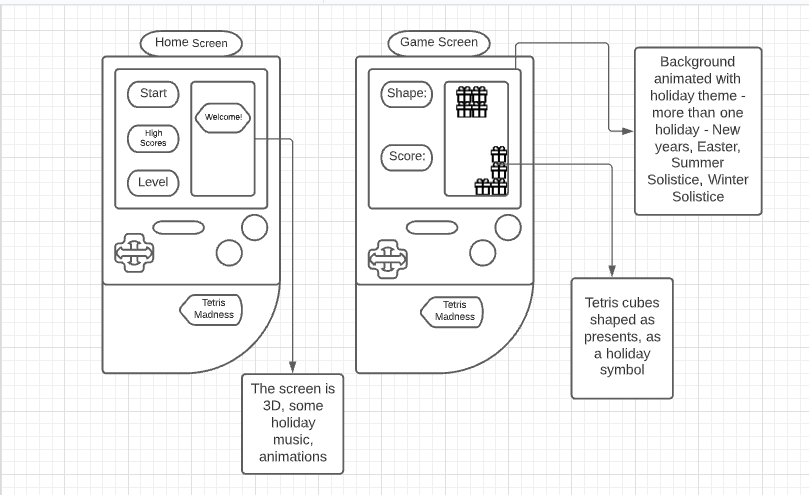

# Tetris Game Holiday Theme
- brief description, image of finished game

## Wireframe

- Original idea

-- do we need user stories? ask the team :)

# Building

## Programs, libraries, modules, frameworks used

- Description of the steps made to create this game
- List programs used

# Instructions

- How to play, steps, options

# Deployment 

- check with team if we want to include this section

# Creators of this game with maybe links to each git repo's

- check with team about this