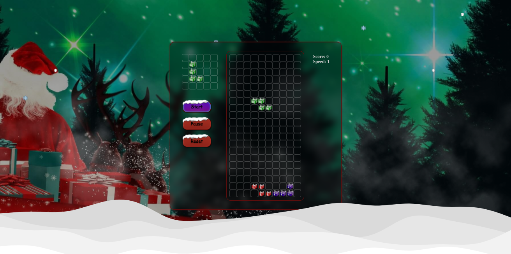
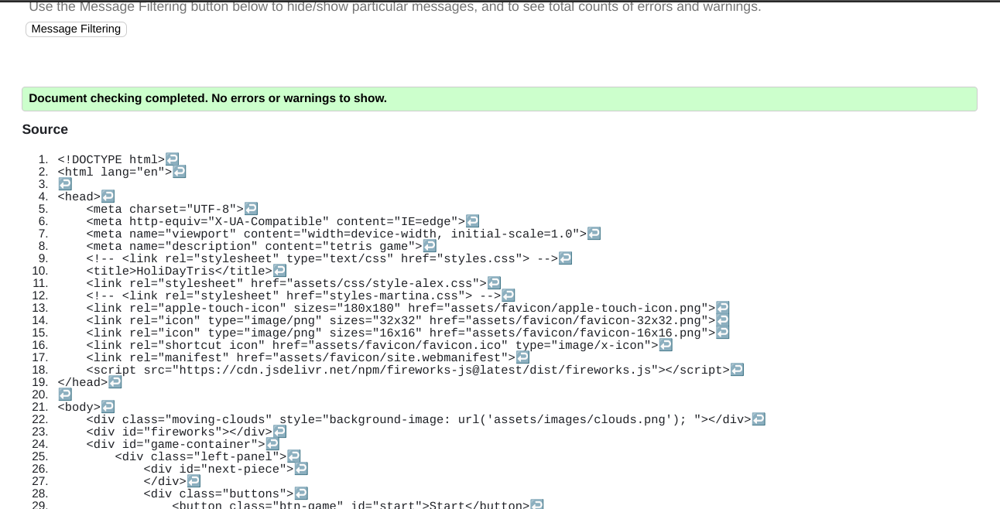
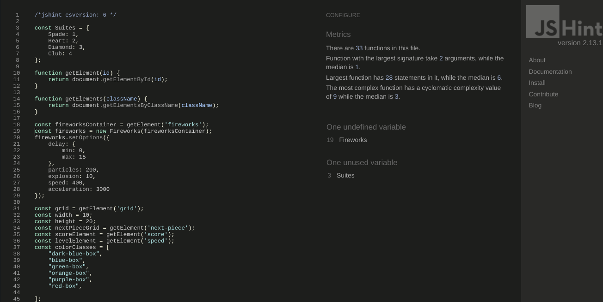

# Tetris Game Holiday Theme

This game is to entertain the user and making a nice holiday mood while playing the only game that has been in outer space according to these interesting [facts](https://www.dailydot.com/parsec/tetris-game-facts/).

## Finished Game Image 

## Wireframe

- Original idea

## Building

The JavaScript code for functionality of this game was primarily made by Alex Konolov, from scratch, with help of Anders Olesen, team lead.
CSS and HTML code was created by all four members of the 'Team-six' to put together this final product for Hackathon, December, 2021

### Programs Used

- HTML
- CSS
- JavaScript (library for fireworks, by JavaScript)

## Instructions

- This game is played by using arrow keys on the keyboard
- Tetrimino shapes are falling one by one, until they reach the bottom and freeze their position, allowing the next shape to start falling
- During fall, the tetrimino shapes can be moved to left or right, or speed up falling by pressing down arrow key, and also rotate
- Aim is to connect a row of filled out cubicles, and therefore, eliminate the respected row, with fireworks effect at that moment
- Score is achieved with every 'destruction' of the row
- After reaching score of 50, the speed increases, and therefore every 50 points after, the speed is increased by 1.

## Testing 

### Validation
HTML - no errors

CSS - no errors

JavaScript - minor errors

## Deployment 

- To be done

## Resources

- The background image is found on [Adobe Stock](https://stock.adobe.com/ie/) and direct link to the image is [here](https://as2.ftcdn.net/v2/jpg/00/94/58/43/1000_F_94584328_iLRDmZhU1DKJSMYhBObH2Tniaso4bA1A.jpg).
- The opened box which displays the incoming tetris shapes was found [here](https://pngtree.com/freepng/opened-red-ribbon-wrapping-christmas-gifts_5546127.html).
- The footer snow is found on this [link](https://files.slack.com/files-pri/T0L30B202-F02Q01R7N8P/realistic-snowdrift-isolated_160081-9.jpg).
- The effect of snow falling is found on [Code Pen](https://codepen.io/) and the code for snowflakes is [here](https://codepen.io/codeconvey/pen/xRzQay).

- 